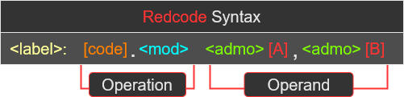

<H2> Redcode Tutorial </H2>

___
- [1. Glosary](#1-glosary)
  - [1.1. Acronyms / Abbreviations Dictionary](#11-acronyms--abbreviations-dictionary)
- [2. Starting with the Basics](#2-starting-with-the-basics)
  - [2.1. Syntax](#21-syntax)
  - [2.2. Operations over Operands `[A], [B]`](#22-operations-over-operands-a-b)
  - [2.3. Addressing Modes `<admo>`](#23-addressing-modes-admo)
  - [2.4. Modifiers `<mod>`](#24-modifiers-mod)
- [3. Redcode Definitions](#3-redcode-definitions)
  - [3.1. Labels](#31-labels)
  - [3.2. `[code]` List](#32-code-list)
  - [3.3. `<mod>` Defaults](#33-mod-defaults)
___

[Return to README](../README.md)
___

 

# 1. Glosary
**You may need to return here throughtout the tutorial**

## 1.1. Acronyms / Abbreviations Dictionary  
A/A      | Full Name
:-:      | :--
`[code]` | Opcode
`<mod>`  | Modifier
`<admo>` | Addressing Mode
`[A]`    | A - Field
`[B]`    | B - Field
`EXE`    | Executing (current) instruction
`SRC`    | Source instruction
`DEST`   | Destination instruction
`ADR`    | Address
`VAL`    | Value
`PTR`    | Pointer

 

# 2. Starting with the Basics
**Redcode** is an `abstract assembly language` used in **Corewar**, which was designed by [A. K. Dewdney](https://en.wikipedia.org/wiki/A._K._Dewdney).
 

Redcode is a briiliant way to learn assembly code.  
The abstraction removes the prerequisites to know low-level computer concepts...
  * CPU Registers
  * Memory Management
  * Data Representation

Another bonus is the program size, as most assembly programs requires a lot of code to run a simple program.  
But corewar programs are very small, some can even be a single line of code!  
 * "`mov 0, 1`" is a program that repeated moves itself one space ahead

 

## 2.1. Syntax
Redcode syntax is quite basic.  

 
 * "`< >`" denotes `optional` 
 * "`[ ]`" denotes `mandatory`

So at a minimum "`[code] [A], [B]`" is **required!**
  * There are some exceptions allowing no `[B]`, this will be covered later to avoid confusion
  
**What does it all mean?**  
Lets ignore `optional` `< >` arguments for now and start with the `mandatory` `[ ]` arguments.  

Notation  | Name        | Desciption
:-:       | :-:         | :--
`[code]`  | `Opcode`    | Determines the `Operation` to perform over an `Operand`(s)
`[A]`     | `A - Field` | Used as an `Operand` for the `[code]` `operation`, it stores an ADR **or** VAL 
`[B]`     | `B - Field` | Same as `[A]` but holds a different ADR/VAL
  
Looking back to the Redcode Syntax image we can see two important sections...
 * `Operation` and `Operand`
 * **These are the essence of assembly code!**

Think back to the single line program `mov 0, 1`, its syntax format it `[code] [A], [B]`.
Let break it down...
 * `Operation`:
   - `mov` is telling the program to move the instruction at the `ADR` of `0` to `ADR` `1`
   - Lets quickly clarify that `mov` actually `copies`, it will NOT delete anything

 

## 2.2. Operations over Operands `[A], [B]`

 

## 2.3. Addressing Modes `<admo>`

 

## 2.4. Modifiers `<mod>`

  

# 3. Redcode Definitions

## 3.1. Labels
Labels are aliases used to reference a specific address within the program, which makes the code more concise.  
There are two types of label...
 1. `Declared:` determines the address of the label
    * `my_label: nop 0, 0`
 2. `Reference`: used in the operand arguments to reference the address of the label specified
    * `nop 0, my_label`

Full Example:  
Line | Code              | Parser Output
--:  |:--                |:--
0| `nop 0, 0`            |               
1| `my_label: nop 0, 0`  | -> {Parser} -> `LabelLinker("my_label")` = address `1`  
2| `nop 0, 0`            |               
3| `nop 0, my_label`     | -> {Parser} -> `nop $0, $-2` -> ( address `3` + `-2` = `1` )
  
Here is a breakdown of the label `rules`
 1. Must start with, '`a-z`', '`A-Z`', or '`_`'
 2. Only allows `Alphanumeric` characters plus underscores '`_`'
 3. Declared labels can optionally end with '`:`'
    * But Reference labels must not contain '`:`'

## 3.2. `[code]` List
All operations are listed here and seperated by types...
 * Read/Write
 * Comparision
 * Arithmetic
 * Jump

**Note**: `nop`, `dat`, `jmp` and `spl` all do not use the `B field`, but a value can still be stored here

Operation Type | | ¬ Type's Collective Action
:-:      | :--  | :--
`[code]` | Name | Desciption
___

<!-- Read/Write -->
Read/Write | |¬ 
:-:      | :--  | :--
`nop` | No Operation | Literally does nothing, useful for storing values
`dat` | Data         | Illegal operation, kills the `EXE`'s process
`mov` | Move (copy)  | Overwrites `SRC` with `DEST`

<!-- Comparision -->
Comparision |             | ¬ Skip Next `EXE` ( `ADR` +2 ) `IF`:
:-:      | :--  | :--
`seq` | Skip IF Equal     | `SRC` == `DEST`
`sne` | Skip IF NOT Equal | `SRC` != `DEST`
`slt` | Skip if Less Than | `A` < `B`

<!-- Arithmatic -->
Arithmatic | |¬ `B` = ?
:-:      | :--   | :--
`add` | Add      | `A` + `B`
`sub` | Subtract | `A` - `B`
`mul` | Multiply | `A` * `B`
`div` | Divide   | `A` / `B`
`mod` | Modulus  | `A` % `B`

**Warning**: division by `0` with `mod` or `div` is considered illegal, they will function like a `dat`

<!-- Jump -->
Jump |                               | ¬ Set `EXE` to `ADR` of `SRC`
:-:      | :--  | :--
`jmp` | Jump                         | Standard ¬ `Action`
`jmz` | Jump IF Zero                 | `IF`: `B` == `0`
`jmn` | Jump IF NOT Zero             | `IF`: `B` != `0`
`djn` | Decrement & Jump IF NOT Zero | `IF`: after --`A`, `B` != `0`
`spl` | Split                        | But create a `new process`, and the current `EXE` moves to next
___
 

## 3.3. `<mod>` Defaults
...