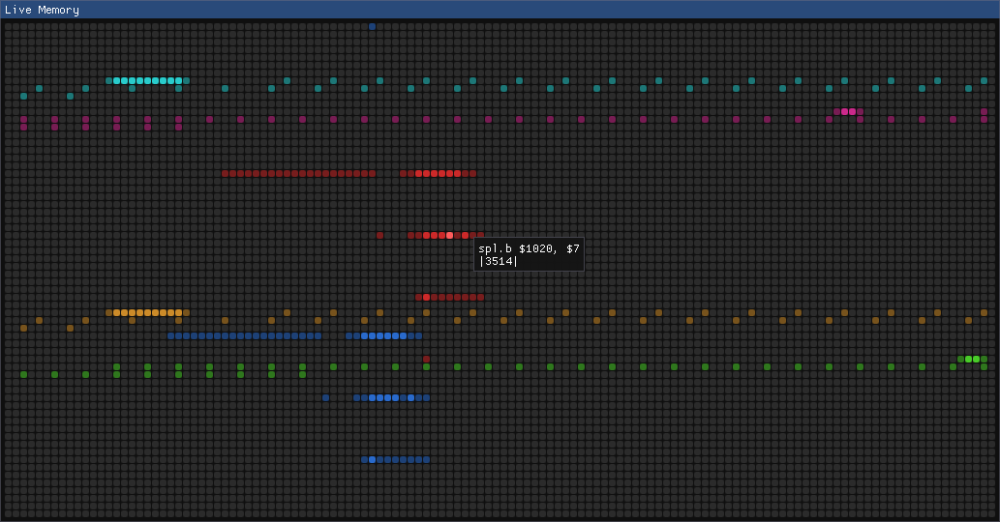

<H1> corewar-mkii </H1>

**Corewar Mark 2** features an operating system which concurrently executes multiple `Redcode` assembly programs.
A **Live Memory** display is then used to view each assembly program's execution in **real-time**, with the goal of helping users learn and understand `assembly code` in a `gamified` format.

Based on the original **[1984 corewar](https://en.wikipedia.org/wiki/Core_War)**.
___
- [1. Showcase](#1-showcase)
  - [1.1. Live Memory](#11-live-memory)
  - [1.2. Control Panel](#12-control-panel)
  - [1.3. Redcode Tutorial](#13-redcode-tutorial)
  - [1.4. Example Warriors](#14-example-warriors)
- [2. Getting Started](#2-getting-started)
  - [2.1. Requirements](#21-requirements)
  - [2.2. How to Build](#22-how-to-build)
  - [2.3. CMake Notes](#23-cmake-notes)
  - [2.4. Vendors](#24-vendors)
- [3. How to Run](#3-how-to-run)
- [4. Playing the Game](#4-playing-the-game)
  - [4.1. Redcode Tutorial](#41-redcode-tutorial)
___

 

# 1. Showcase
Players write assembly programs known as `warriors` in `Redcode` and load them into an **operating system (OS)** alongside **competing warriors**.

The goal is to 'fight for control of the core', **eliminating** the other warrior programs by forcing all their running processes to execute **illegal** assembly instructions which **kill** the executing process.

There are three illegal instructions:
  1. `dat` (data)
  2. Any `div` (division) by `0`
  3. Any `mod` (modulo) by `0`

## 1.1. Live Memory
Players can view each individual memory address of the OS in real-time, seeing the changes made to the system with every CPU cycle.

## 1.2. Control Panel
Players can use the control panel to command the game state, including freezing the OS and still view the memory.

Each section provides a `(Help ?)` tool tip.

To play a game, select warriors from the `warriors` folder
   * Multiple of the same warrior can be selected
   * Minimum: `2`
   * Maximum: `9`
 * Then click `Load Selected` and `Play`

## 1.3. Redcode Tutorial
A [tutorial for Redcode](docs/REDCODE_TUTORIAL.md) has been provided.

**Important!**
The game features a minimalistic Redcode standard.
Only the 16 original opcodes from the 94 standard are used, no high level elements are included.

## 1.4. Example Warriors
To help players get started, the following example warrior programs have been provided in the `warriors` folder...

Filename       | Desc
:-:            | :--
`imp.asm`      | single instruction program
`rock.asm`     | small `dat` code bomber
`paper.asm`    | self-replicating, creates multiple clones
`scissors.asm` | scans the memory for programs and then heavily bombs the area

 

# 2. Getting Started

## 2.1. Requirements
**Build Tools:**
 * Compiler that supports `C++17`
 * `CMake` ( [Install Link](https://cmake.org/install/) )
 * `Make`

**Recommended System:**
OS                  | CPU     | RAM    | GPU                                  | Disk Space
:-:                 | :-:     | :-:    | :-:                                  | :-:
Win10, Linux, MacOS | 1.4 Ghz | 512 MB | 1GB Video Memory, OpenGL 3.0 support | 64 MB

## 2.2. How to Build
1. Open a terminal in the `build/` directory containing `.gitkeep`
2. Run `cmake -S ../ -B .`
   * optionally `ctest` can be run to print the results of the tester programs
3. If no errors were reported, run `make install`
4. A directory called `corewar-mkii/` should be present in the build directory.
   * `corewar-mkii/` is fully portable, you can move it where you want.

See the [How to Run](#3-how-to-run) section.

## 2.3. CMake Notes
When running CMake there a two consideration to be made:
1. The Operating System's **`C++ compiler`**
   * Examples...
     - Windows, using `MinGW`, requires appending `-G "MinGW Makefiles"` to the end of the CMake command
     - Linux, using `GCC`, doesn't require extra arguments (typically)
2. Where you want to **build** the Makefile project:
   * A standard CMake command is formulated as: `cmake -S <src_dir> -B <build_dir>`
   * The `<src_dir>` **must** be the directory where the **root** `CMakeLists.txt` resides
   * The `<build_dir>` is the target directory where all the generated `Makefile` project files are placed
     - Example: using `cmake -S ../ -B .` from the `build/` directory will generate the `Makefile` project in `build/`

## 2.4. Vendors
All vendors are third-party libraries not owned by this project.

Ref | Name | Version | Use
:-: | :--  | :-- | :--
`<imgui>` | [Dear ImGui](https://github.com/ocornut/imgui/tree/docking)                | 1.8 (Docking) | Corewar GUI
`<GLFW>`  | [Graphics Library Framework](https://github.com/glfw/glfw/tree/3.3-stable) | 3.3 (Stable)  | `OpenGL` Library for Dear ImGui
`<GLAD>`  | [GLAD](https://github.com/Dav1dde/glad)                                    | 3.3           | Function loader for `OpenGL`

`GLAD` was generated [here!](https://glad.dav1d.de/)

 

# 3. How to Run
**After** the [How to Build](#22-how-to-build) steps are complete, several key elements should be present in the `corewar-mkii/` directory:
1. `corewar-mkii` as the executable
2. `warriors/` containing example assembly programs `imp.asm`, `rock.asm`, `paper.asm`, and `scissors.asm`
3. `.gui.ini`  required to ensure the GUI loads in a pre-configured state
4. `corewar.ini` configuration file for the following match settings:

 Name             | Impact
 :-:              | :--
**core_size**     | cannot be configured and is forced to `8192` for stability and to keep the GUI uniform
`max_rounds`      | max number of rounds before the game is concluded
`max_cycles`      | max number of cycles before the round has been concluded
`max_processes`   | max number of processes a single warrior can create
`max_warrior_len` | max instructions a warrior can consist of
`min_separation`  | min distance between warriors at the start of a round

 

**Run the Game** by executing `corewar-mkii`, then select the desired warriors to use, click `load selected` and finally start a game!
* Once familiar with the game, try:
    * Altering the games settings via the `corewar.ini` to see different outcomes
    * Write your own **warrior** in Redcode assembly and have it compete against others

**Important!** `warriors/` and `corewar.ini` MUST be present for the executable to run

 

# 4. Playing the Game
**Warriors** are programs written in an `abstract assembly language` called `Redcode`

The goal of the game is to have multiple warrior oppnents 'fight for control of the core' (memory)

As the player you want to write a program to kill all other programs who also occupy the same **memory** space.

All assembly programs you wish to load **must** be in the `warriors/` directory

If you don't want to write your own program see the [Example Warriors](#14-example-warriors) section for pre-made assembly programs you can use.

## 4.1. Redcode Tutorial
Check out the [Redcode Tutorial](docs/REDCODE_TUTORIAL.md) to get started on writing a program.
Once you feel ready, boot up `corewar-mkii` and load your program to fight one of the example programs.
 * You can also have a friend write a program to fight your programs
