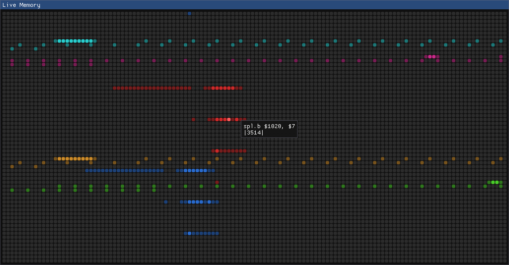
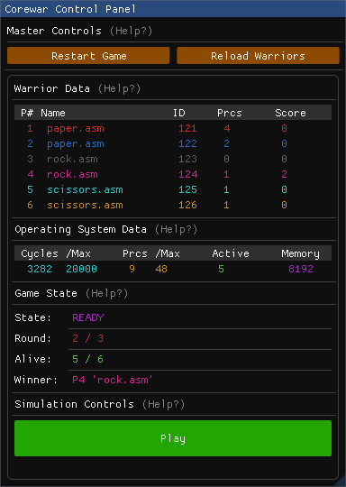

<H1> corewar-mkii </H1>

**Corewar Mark 2** is a game based on the original **1984 corewar**.  

It features far richer insite into the internal operating system's data in **real-time** to help users learn `assembly code`.  

___
- [1. Showcase](#1-showcase)
  - [1.1. Live Memory](#11-live-memory)
  - [1.2. Control Panel](#12-control-panel)
  - [1.3. Redcode Tutorial](#13-redcode-tutorial)
  - [1.4. Example Warriors](#14-example-warriors)
- [2. Getting Started](#2-getting-started)
  - [2.1. How to Build](#21-how-to-build)
  - [2.2. CMake Notes](#22-cmake-notes)
  - [2.3. Requirements](#23-requirements)
  - [2.4. Vendors](#24-vendors)
- [3. How to Run](#3-how-to-run)
- [4. Playing the Game](#4-playing-the-game)
  - [4.1. Redcode Tutorial](#41-redcode-tutorial)
___

 

# 1. Showcase
Players write assembly programs known as `warriors` in `Redcode` and load them into an **operating system (OS)** alongside **competing warriors**.  

The goal is to 'fight for control of the core', **eliminating** the other warrior programs by forcing all their running processes to execute **illegal** assembly instructions which **kill** the executing process.  

There are three illegal instructions:
  1. `dat` (data).
  2. Any `div` (division) by `0`
  3. Any `mod` (modulo) by `0`   

## 1.1. Live Memory
Players can view each individual memory address of the OS in real-time, seeing the changes made to the system with every CPU cycle.  

## 1.2. Control Panel
Players can use the control panel to command the game state, including freezing the OS and still view the memory.  

Each section provides a `(Help ?)` tool tip.  

To play a game, select warriors from the `warriors` folder
   * Multiple of the same warrior can be selected
   * Minimum: `2`
   * Maximum: `9`
 * Then click `Load Selected` and `Play`

## 1.3. Redcode Tutorial
A [tutorial for Redcode](docs/REDCODE_TUTORIAL.md) has been provided.  

**Important!**  
The game features a minimalistic Redcode standard.  
Only the 16 original opcodes from the 94 standard are used, no high level elements are included.

## 1.4. Example Warriors
To help players get started, the following example warrior programs have been provided in the `warriors` folder...

Filename       | Desc 
:-:            | :--
`imp.asm`      | single instruction program
`rock.asm`     | small `dat` code bomber
`paper.asm`    | self-replicating, creates multiple clones
`scissors.asm` | scans the memory for programs and then heavily bombs the area

 

# 2. Getting Started

## 2.1. How to Build
1. Open a terminal in the `build/` directory containing `.gitkeep`
2. Before running `CMake` please read [CMake Notes](#22-cmake-notes): 
    * Run `cmake -S ../ -B .` (or adjust the command to your needs)
3. Run `make` if no errors were reported. 
4. Process Complete: An executable `corewar` should be present in the build directory
   * 4.5. optionally `ctest` can be run to print the results of the corewar test suites

## 2.2. CMake Notes
CMake should be packaged with `Make` and `CTest`.  
When running CMake there a two consideration to be made:
1. The Operating System's **`C++ compiler`**
   * Examples...
     - Windows, using `MinGW`, requires appending `-G "MinGW Makefiles"` to the end of the CMake command
     - Linux, using `GCC`, doesn't require extra arguments (typically)
2. Where you want to **build** the program:
   * A standard CMake command is formulated as: `cmake -S <src_dir> -B <build_dir>`
   * The `<src_dir>` **must** be the directory where the **root** `CMakeLists.txt` resides
   * The `<build_dir>` is the target directory where all the generated `Makefile` project files are placed
     - Example: using `cmake -S ../ -B .` from the `build/` directory will generate the `Makefile` project in `build/`

## 2.3. Requirements
 * Compiler that supports `C++17`
 * `CMake`
 * `Make`
 * `CTest` (optional)

## 2.4. Vendors
 * Found under [VENDORS.md](vendor/VENDORS.md) in `vendor/` 

 

# 3. How to Run  
**After**  the [How to Build](#21-how-to-build) steps are complete, several elements should be present in the `build/` directory:
1. `corewar-mkii` as the executable
2. `warriors/` containing example assembly programs `imp.asm`, `rock.asm`, `paper.asm`, and `scissors.asm`
3. `corewar.ini` a configuration file for the following match settings:
  
 Name             | Impact                                                                              
 :-:              | :--                                                                                 
**core_size**     | cannot be configured and is forced to `8192` for stability and to keep the GUI uniform
`max_rounds`      | max number of rounds before the game is concluded                                   
`max_cycles`      | max number of cycles before the round has been concluded                           
`max_processes`   | max number of processes a single warrior can create                                 
`max_warrior_len` | max instructions a warrior can consist of                                           
`min_separation`  | min distance between warriors at the start of a round                               

 

**Run the Game** by executing `corewar-mkii`, then select the desired warriors to use, click `load selected` and finally start a game!  
* Once familiar with the game, try:
    * Altering the games settings via the `corewar.ini` to see different outcomes
    * Write your own `warriors/` in assembly and have them compete
    
**Important!** `warriors/`, `corewar.ini`, and `.gui.ini` MUST be present with the executable

 

# 4. Playing the Game
**Warriors** are programs written in an `abstract assembly language` called `Redcode`  

The goal of the game is to have multiple warrior oppnents 'fight for control of the core'  

As the player you want to write a program to kill all other programs in the game who also occupy the same `memory` space.

## 4.1. Redcode Tutorial
Check out the [Redcode Tutorial](docs/REDCODE_TUTORIAL.md) to get started on writing a program.  
Once you feel ready, boot up `corewar-mkii` and load your program to fight one of the example programs.  
 * You can also have a friend write a program to fight your programs

Thanks and have fun learning to code in assembly!  
