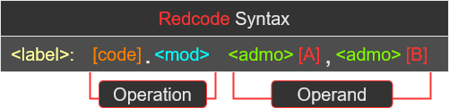
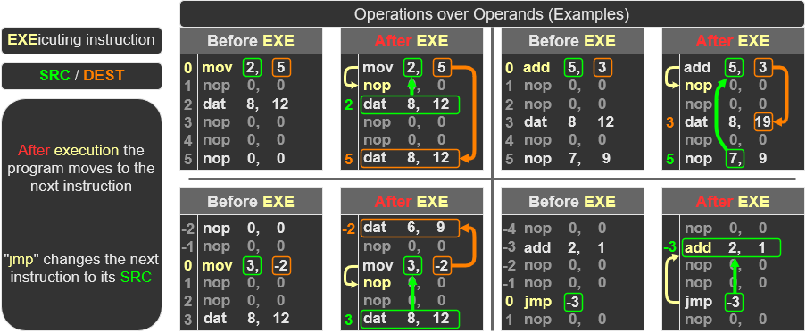
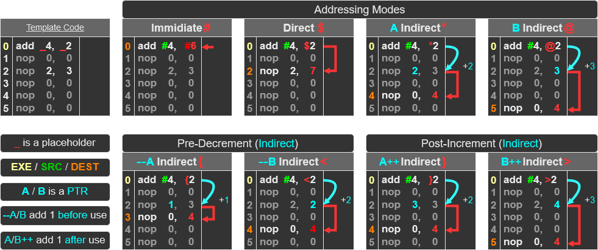

<H2> Redcode Tutorial </H2>

___
- [1. Glosary](#1-glosary)
  - [1.1. Acronyms / Abbreviations Dictionary](#11-acronyms--abbreviations-dictionary)
- [2. Starting with the Basics](#2-starting-with-the-basics)
  - [2.1. Syntax](#21-syntax)
  - [2.2. Operations over Operands `[code] [A], [B]`](#22-operations-over-operands-code-a-b)
  - [2.3. Addressing Modes `<admo>`](#23-addressing-modes-admo)
  - [2.4. Modifiers `<mod>`](#24-modifiers-mod)
  - [2.5. Labels](#25-labels)
  - [2.6. Strategies & Example Programs](#26-strategies--example-programs)
- [3. Redcode Opcodes and Defaults](#3-redcode-opcodes-and-defaults)
  - [3.1. All Opcodes `[code]`](#31-all-opcodes-code)
  - [3.2. Modifier Defaults `<mod>`](#32-modifier-defaults-mod)
___

 

# 1. Glosary
**You may need to return here throughtout the tutorial**

## 1.1. Acronyms / Abbreviations Dictionary  
A/A      | Full Name
:-:      | :--
`[code]` | Opcode
`<mod>`  | Modifier
`<admo>` | Addressing Mode
`[A]`    | A - Field
`[B]`    | B - Field
`EXE`    | Executing (current) instruction
`SRC`    | Source instruction
`DEST`   | Destination instruction
`ADR`    | Address
`VAL`    | Value
`PTR`    | Pointer

 

# 2. Starting with the Basics
**Redcode** is an `abstract assembly language` used in **Corewar**, which was designed by [A. K. Dewdney](https://en.wikipedia.org/wiki/A._K._Dewdney).
 

Redcode is a great way to learn assembly code.  
The abstraction removes the prerequisites to know low-level computer concepts...
  * CPU Registers
  * Memory Management
  * Data Representation

Another bonus is the program size, as most assembly programs requires a lot of code to run a simple program.  
But corewar programs are very small, some can even be a single line of code!  
 * "`mov 0, 1`" is a program that repeated moves itself one space ahead

You can find an example in the `warriors/` folder under `imp.asm` 

For this project, the full `Redcode 94` standard has not been implemented.
 * This is to keep the learning assembly code process as simple as possible

**Important!**  

The Redcode standard for `corewar-mkii` is a **minimal** version of the `Redcode 94` standard.  
 * Only assembly instructions are allowed in the minimal version and NOT the higher-level nuances
 * If it is not part of the syntax diagram below, it is not allowed  

 

## 2.1. Syntax
Redcode syntax is quite basic.  

 
 * "`< >`" denotes `optional` 
 * "`[ ]`" denotes `mandatory`

So at a minimum "`[code] [A], [B]`" is **required!**
  * There are some exceptions allowing no `[B]`, this will be covered later to avoid confusion
  
**What does it all mean?**  
Lets ignore `optional` `< >` arguments for now and start with the `mandatory` `[ ]` arguments.  

Notation  | Name        | Desciption
:-:       | :-:         | :--
`[code]`  | `Opcode`    | Determines the `Operation` to perform over an `Operand`(s)
`[A]`     | `A - Field` | Used as an `Operand` for the `[code]` `operation`, it stores an ADR **or** VAL 
`[B]`     | `B - Field` | Same as `[A]` but holds a different ADR/VAL

 

## 2.2. Operations over Operands `[code] [A], [B]`
Looking back to the Redcode Syntax image we can see two important sections...
 * `Operation` and `Operand`
 * **These are the essence of assembly code!**

 

Think back to the single line program `mov 0, 1`, its syntax format is `[code] [A], [B]`.  
**Let break it down...**  
`[code] [A], [B]` is an assembly instruction, know as the `executing` instruction (`EXE`)  
 * We consider its `ADR` as `0`
    - `[code]` is the `operation` to perform, i.e. `[mov]` (move), `[add]` (add), `jmp` (jump).

`[A]` is the `source` instruction (`SRC`)  
`[B]` is the `destination` instruction (`DEST`)  

**So what does it mean?**  
 EXE | `mov 0, 1`
--:  | :--
SRC  | `0`
DEST | `1`

The `EXE` is telling the CPU, "move the `SRC` to the `DEST`"  
 * All addresses in recode are `relative` to the `EXE`  

With the `SRC` being `0`, its ADR is the `EXE`'s ADR  
`DEST` is `1`, it's ADR is one ahead of `EXE`.  

Finally we can understand the `SRC` (`mov 0, 1`) is place at the `DEST` (the next ADR ahead of `EXE`)  

ADR | Before | After
:-: | :-: | :--:
 0  | `mov 0, 1`   | `mov 0, 1` |
 1  | `add 10, 20` | `mov 0 ,1` |

**Important!**: Lets quickly clarify that `mov` actually `copies`, it will NOT delete anything

Here are the `opcode types`  
Type | Description
:-      | :- 
`System`      | Interact with the system, `mov` copies, `dat` kills a process, ect. 
`Comparision` | Compares the source `SRC` against the `DEST`, and skips the next `EXE` if true
`Arithmetic`  | Performs arithmatic on the `DEST` using the `SRC`, i.e. `DEST` = `DEST` + `SRC`
`Jump`        | Moves the next `EXE` to the `SRC` ADR

**Important!** After the `EXE` has finshed, the next `EXE` is the one ADR ahead.
 * However a `Comparison` or `Jump` can change the next `EXE`

Heres a list of [All Opcodes](#31-all-opcodes-code)

**Check out these four example diagrams of the `EXE` before and after.**

 

## 2.3. Addressing Modes `<admo>`
Addressing modes (`<admo>`) determine how the `SRC` (`[A]`) and `DEST` (`[B]`) are addressed.  
 * They are better explained using the table and diagrams below.  

Mode `<admo>` | Behaviour
:-: | :-: 
 Immidiate        `#` | The ADR is set to `0`, so `[A]`/`[B]` can be used as a raw value
 Direct           `$` | The `default` if no `<admo>` is provided, it targets the ADR directly
 Indirect A       `*` | The target's `[A]` field is used as a PTR 
 Indirect B       `@` | Same as above but for the targets `[B]` field
 Pre-Decrement A  `{` | 'Indirect' but the value pointed to is `decremented` `before` use
 Pre-Decrement B  `<` | See above for `[B]`
 Post-Increment A `}` | 'Indirect' but the value pointed to is `incremented` `after` use
 Post-Increment B `>` | See above for `[B]`

 

## 2.4. Modifiers `<mod>`

There are three types of modifiers.
 * `single`: One field (`[A]`, `[B]`) from the `SRC` and `DEST` is used
 * `double`: Both fields are used
 * `full`: The entire `SRC` and `DEST` is used

They are better explained using tables and diagrams.
`<mod>` | Type | Behaviour
:-: | :-: | :-
 `.a`  | `single` | SRC : `[A]`             -> `[A]`             : DEST
 `.b`  | ->       | SRC : `[B]`             -> `[B]`             : DEST
 `.ab` | ->       | SRC : `[A]`             -> `[B]`             : DEST
 `.ba` | ->       | SRC : `[B]`             -> `[A]`             : DEST
 `.f`  | `double` | SRC : `[A],[B]`         -> `[A],[B]`         : DEST
 `.x`  | ->       | SRC : `[A],[B]`         -> `[B],[A]`         : DEST
 `.i`  | `full`   | SRC : `[code] [A], [B]` -> `[code] [A], [B]` : DEST

 

<H3>Important Modifier Info!</H3>  

`nop`, `dat`, `jmp` and `spl` **IGNORE** modifiers  

`mov`, `seq`, `sne` are the ONLY opcodesthat can use  

All `Jump` type opcodes can only apply `[A]` --> `[A]`, or `[B]` --> `[B]`
   * Therefore . . .
   * `.ab` == `.b`
   * `.ba` == `.a`
   * `.x`, `.i` == `.f`

**Also See:** [Modifiers Default](#32-modifier-defaults-mod) 

 

## 2.5. Labels
Labels are aliases used to reference a specific address within the program, which makes the code more concise.  
There are two types of label...
 1. `Declared:` determines the address of the label
    * `my_label: nop 0, 0`
 2. `Reference`: used in the operand arguments to reference the address of the label specified
    * `nop 0, my_label`

Full Example:  
Line | Code              | Parser Output
--:  |:--                |:--
0| `nop 0, 0`            |               
1| `my_label: nop 0, 0`  | -> {Parser} -> `LabelLinker("my_label")` = address `1`  
2| `nop 0, 0`            |               
3| `nop 0, my_label`     | -> {Parser} -> `nop $0, $-2` -> ( address `3` + `-2` = `1` )
  
Here is a breakdown of the label `rules`
 1. Must start with, '`a-z`', '`A-Z`', or '`_`'
 2. Only allows `Alphanumeric` characters plus underscores '`_`'
 3. Declared labels can optionally end with '`:`'
    * But Reference labels must not contain '`:`'

 

## 2.6. Playing Corewar & Strategies Example Programs
In `corewar` you write a program (warrior) to fight other programs within the same memory space  
To defeat another program, all their processes need to be killed.   
So your programs goal is to force them to execute an illegal `operation` of either:
 * `dat`
 * `div` or `mod` by `0`

`spl` allows your program to create additional processes, giving your program mor resilience 

 

<H3> Example Strategy Programs </H3>

You can find the following example strategy programs in the `warriors/` folder:  
`imp.asm`
 * A single instruction program which moves its `EXE` to the next `EXE` ADR

`rock.asm`
 * Uses a brute force approach, placing 'bombs' (`dat`) across addresses as fast as possible  
 * Rocks are small, making them hard to detect thus great against `scissors`

`paper.asm`
 * Self replicating, uses `spl` to create loads of clones each running their own process
 * Paper is hard to kill with brute force, but `scissors` can locate them easily

`scissors.asm`
 * Scans the memory, uses `comparison` opcodes to find targets in memory
 * When a target is found a 'cluster bomb' is deployed in a loop
 * Once the bomb has finished deploying the program will begin scanning again
   * Scissors is great against `paper` but can struggle locating `rock` as they are small

Now you should have enough content to try and make your own program.  
You can also test out some of the examples in `Corewar`

# 3. Redcode Opcodes and Defaults

## 3.1. All Opcodes `[code]`
All operations are listed here and seperated by types...
 * System
 * Comparision
 * Arithmetic
 * Jump

**Note**: `nop`, `dat`, `jmp` and `spl` all do not use the `B field`, but a value can still be stored here

<!-- Tbl Header -->
Operation Type | | `Action` --> of all `[code]`s within the operation type 
:-:      | :--  | :--
`[code]` | Name | Desciption
___

<!-- System -->
System | |_
:-: | :--  | :--
`nop` | No Operation | Literally does nothing, useful for storing values
`dat` | Data         | Illegal operation, kills the `EXE`'s process
`mov` | Move (copy)  | Overwrites `SRC` with `DEST`
`spl` | Split        | But create a `new process`, and the current `EXE` moves to next

<!-- Comparision -->
Comparision |             | `Action` --> Skip Next `EXE` ( `ADR` +2 ) `IF`: . . .
:-: | :--  | :--
`seq` | Skip IF Equal     | `SRC` == `DEST`
`sne` | Skip IF NOT Equal | `SRC` != `DEST`
`slt` | Skip if Less Than | `A` < `B`

<!-- Arithmatic -->
Arithmatic | | ¬ `B` = ?
:-:      | :--   | :--
`add` | Add      | `A` + `B`
`sub` | Subtract | `A` - `B`
`mul` | Multiply | `A` * `B`
`div` | Divide   | `A` / `B`
`mod` | Modulus  | `A` % `B`

**Warning**: division by `0` with `mod` or `div` is considered illegal, they will function like a `dat`

<!-- Jump -->
Jump  |                              | `Action` --> Set `EXE` to `ADR` of `SRC` . . .
:-: | :--  | :--
`jmp` | Jump                         | Standard `Action`
`jmz` | Jump IF Zero                 | `IF`: `B` == `0`
`jmn` | Jump IF NOT Zero             | `IF`: `B` != `0`
`djn` | Decrement & Jump IF NOT Zero | `IF`: after --`A`, `B` != `0`
___

 

## 3.2. Modifier Defaults `<mod>` 
When a modifier has not been given for `[code]`, a 'default' modifier is applied.

`[code]` | `<admo>[A]` | `<admo>[B]` | Default `<mod>`
:-: | :-: | :-: | :-:
`dat`                                    | any | any | `.f`
`slt`                                    | `#` | any | `.ab`
->                                       | any | any | `.b`
`mov`, `seq`, `sne`                      | `#` | any | `.ab`
->                                       | any | `#` | `.b`
->                                       | any | any | `.i`
`add`, `sub`, `mul`, `div`, `mod`        | `#` | any | `.ab`
->                                       | any | `#` | `.b`
->                                       | any | any | `.f`
`nop`, `spl`, `jmp`, `jmz`, `jmn`, `djn` | any | any | `.b`
